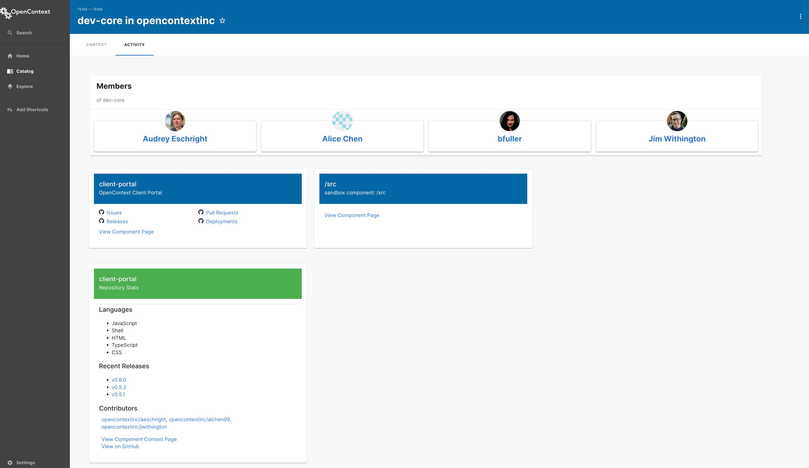

## Release Notes

This release introduces two schema changes. Groups are now Teams, and User has been split off into a Person entity that can be connected to a User.

- A Person has Team memberships, which are automatically created on import from GitHub.
- A User can be associated with multiple Person records, allowing them to navigate between Team relationships and the owned components.
- The User record is required to authenticate them when logging in. In most cases this is automatically created by our Client Portal application.

Also in this release we have a new Team Activity view. This is the place to look to for details on the code, docs, and platform components owned by the team, with additional information about GitHub repositories.

More details on the release below.

### Features

- Add Team Activity tab with additional team context
- Change auth to guest login if `auth.activeProvider` is set to guest (on-prem)
- Create separate Person and User entities to allow graphing team connections in imported org data
- Rename entity Group to Team

### Bug fixes

- Use namespace when importing teams and components from GitHub
- Fix GitHub integration errors involving auth and request pagination
- Removed oncall and isPageable from schema and UI (replaced by PagerDuty integration)
