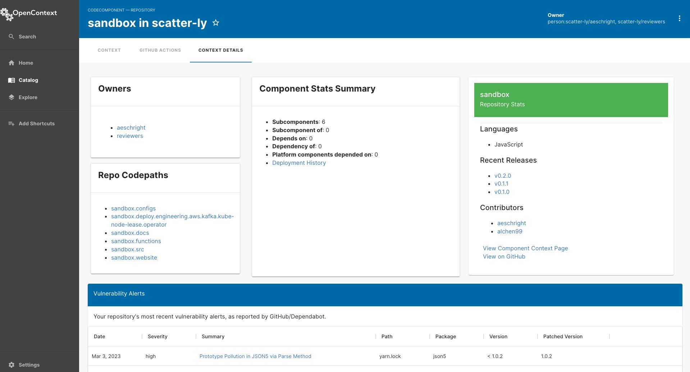

## Release Notes

In this release we have a new on-premise offering with Kubernetes and Helm. For more information on how to set up OpenContext in your own environment see our [docs](https://docs.opencontext.com/docs/getting-started/onprem-install).

Also in this release we have a new Context Details view which can be found on a tab on any CodeComponent. This is the place to look to for more details about a specific CodeComponent. You will see the following:

- Component Owners
- Summary of the component's statistics (relationships to other entities)
- If the CodeComponent is of type repository you will also see repository codepaths (if the repository has any)
- Repository statistics such as languages, recent releases, and contributors
- Repository vulnerability alerts if [Dependabot alerts](https://docs.github.com/en/code-security/dependabot/dependabot-alerts/about-dependabot-alerts) have been [enabled](https://docs.github.com/en/code-security/dependabot/dependabot-alerts/about-dependabot-alerts).

More details on the release below.

### Features

- Added Context Details tab with additional content such as a summary of the component's statistics and various repository information such as owners, codepaths, statistics, and vulnerabilities.
- Added configurations and workflow to build the container for our on-premise offering.

### Bug fixes

- CodeOwners processor will now only process CodeComponents that are not pointing to YAML files
