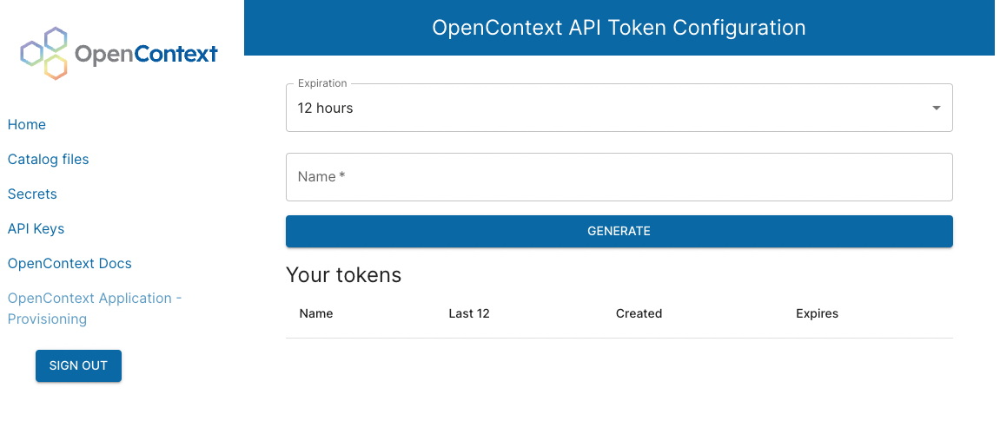
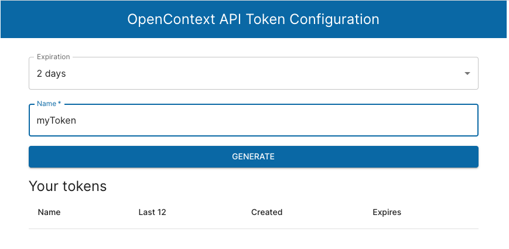

# API Credentials

To access the OpenContext REST API you will need to generate an API token through the Client Portal.

Click on "API Keys" in the sidebar.



Choose an expiration length from between 12 hours to 4 days, then enter a name.



This will generate a JWT for you to use to access the API. You will not be able to access the token again after you leave the page.

To use the JWT, add it to the authorization header of your request:

```bash
JWT=YOUR_JWT
API_VERSION=v1
TENANT_ID=TENANT_ID_IN_LOWERCASE
curl -H "Authorization: Bearer $JWT" https://api.app.opencontext.com/$API_VERSION/$TENANT_ID/api/rest/entities/team/scatter-ly/eng-squirrel
```
