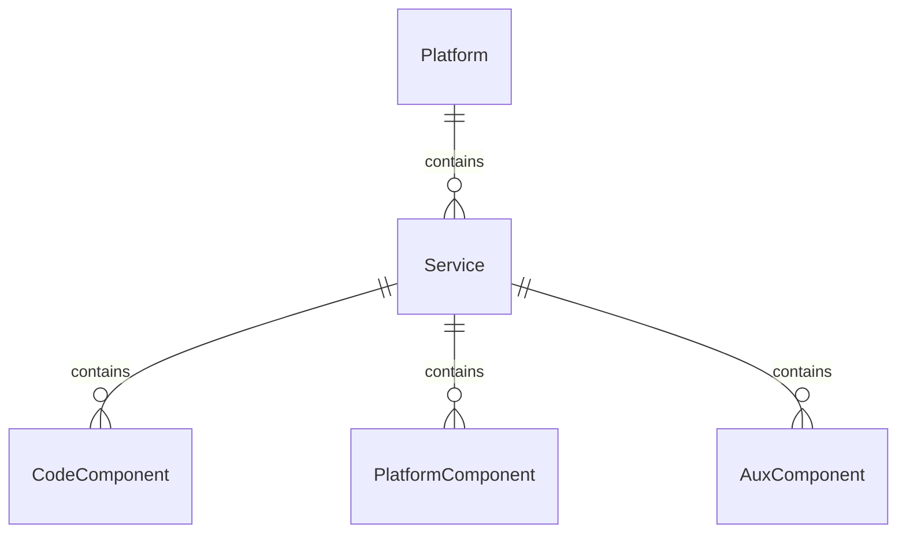

# Catalog Schema

The OpenContext catalog schema is made up of Platforms, Services, CodeComponents, PlatformComponents, AuxComponents, Datacenters, Teams, and Persons. The catalog schema is organized with the following hierarchy at the top:

Other than what is shown in the diagram, components can have multiple relationships to each other, including the addition of teams, persons, and datacenters.
