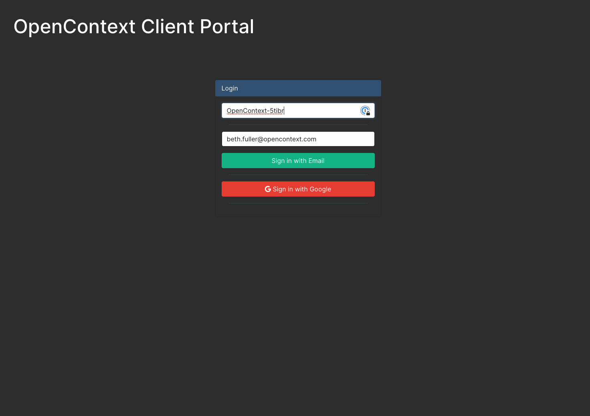

# Using the Client Portal (SaaS Only)

## Initial Login

OpenContext will send a link to the Client Portal. You’ll also be provided with a company ID.

You will receive an emailed link to this page. Here you will link your Google Workspace Account and GitHub if you are connecting to a GitHub repository

## Home

Once you’ve completed the registration, you will have access to the Client Portal.

## Secrets

If you are an Admin you will be able to access `Secrets` on the sidebar. Otherwise the page will send you back to the `Home` page view. Go there to upload secrets or to see any secrets that have been previously uploaded.

:::info To import information from GitHub, you must upload at least one GitHub secret.
:::

You'll need to add your one time GitHub secret in order to allow us to access information about your GitHub repositories.

You’ll enter your `Secrets` here. The first tab shows any existing secrets.

The second tab is for adding new secrets.

## Catalog Files

Some organizations like to create a specific OpenContext Repository to house all of their YAML files. This can make importing easier.

However, if you choose to upload your YAML files one at a time, instead, you can do that by clicking on `Catalog files`.

Once there, you can drag and drop any YAML files you wish to include -- now, or in the future.

## OpenContext Docs

To access the docs site you can go to [docs.opencontext.com](https://docs.opencontext.com/) or click on `OpenContext Docs`.

The Client Portal will send you to this docs site:

