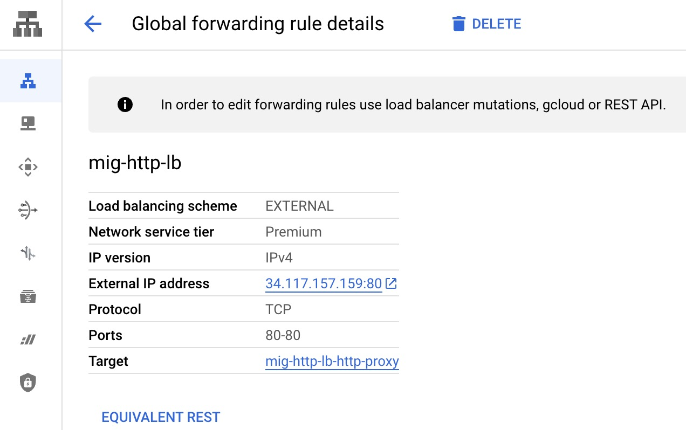

import Tabs from '@theme/Tabs';
import TabItem from '@theme/TabItem';

# Map your Infrastructure

OpenContext allows you to map and describe your infrastructure by creating a [Platform Component](../catalog/catalog-yaml-format/platform-component).

## Gather information

To create your PlatformComponent, you'll need to address a few questions and collect some information.

### Who's responsible for the PlatformComponent?

To find this, see [Map your Organization](map-org). You'll need the OpenContext _entity_ name for the responsible person or team. 

### What components are associated with the PlatformComponent?

For each associated component, you'll need to get the OpenContext [entity reference](../catalog/catalog-yaml-format/entity-reference).

When considering associated components, ask yourself:

- What components depend on this PlatformComponent?
- Is this PlatformComponent a dependency of some other component?
- Is this PlatformComponent part of a [Service](../catalog/catalog-yaml-format/service)?
- Is this PlatformComponent part of a [Datacenter](../catalog/catalog-yaml-format/datacenter)?

### Additional Details 

In addition, you'll need the following information for your PlatformComponent:

- Its lifecycle/environment

Usually, the lifecycle **is** the PlatformComponent environment, such as `production`.

- Its URI 
- Its priority 
- Its SLA 
- PagerDuty details, if any

You'll need any associated [PagerDuty](../configuration/pagerduty-credentials.mdx) service-id or Events API V2 integration key.

- Tags you want to associate with the PlatformComponent, if any
- External links you want associated with the PlatformComponent, if any

## Examples

The following examples will show how to map your infrastructure from Kubernetes, Terraform, and the Cloud Console (GCP) to OpenContext [Platform Component YAML](../catalog/catalog-yaml-format/platform-component).

<Tabs>
  <TabItem value="Kubernetes" label="Kubernetes" default>

Since Kubernetes YAML templates are very similar to OpenContext YAML templates, it should be relatively easy to map one to the other.

### Kubernetes example

Let's take the following Kubernetes Ingress definition for our example:

```yaml
apiVersion: networking.k8s.io/v1beta1
kind: Ingress
metadata:
  name: colors-ingress
  labels:
    app.kubernetes.io/name: colors
  annotations:
    kubernetes.io/ingress.class: traefik
spec:
  rules:
    - host: 'colors.nip.io'
      http:
        paths:
          - path: /
            backend:
              serviceName: colors
              servicePort: 80
```

For this example, you also know the following information:

- lifecycle/env -> `production`
- owner -> `eng-squirrel`
- service -> `k8-colors`
- datacenter -> `kubernetes-1`
- dependency of -> `code-component:colors`
- depends on -> `datacenter:kubernetes-1`
- pagerduty integration key
- priority -> 3
- SLA -> 24x5
- tags -> java
- links -> https://colors.my-monitor.com and https://slack.com

#### Mapping

With this information, you could map your Kubernetes and other collected info to OpenContext in this way:

| Kubernetes YAML Field / Collected Info                                          | OpenContext YAML Field                               | Note                                  |
| ------------------------------------------------------------------------------- | ---------------------------------------------------- | ------------------------------------- |
| `kind`                                                                          | `spec.type`                                          |                                       |
| `metadata.name`                                                                 | `metadata.name`                                      | Must be unique for PlatformComponent! |
| human readable name for the resource                                            | `metadata.title`                                     |                                       |
| description of the resource                                                     | `metadata.description`                               |                                       |
| `metadata.labels` or anything in Kubernetes that doesn't map directly to a spec | `metadata.labels`                                    |                                       |
| `spec.rules.host` or anything in Kubernetes that results in an URI              | `spec.uri`                                           |                                       |
| lifecycle/env                                                                   | `spec.lifecycle`                                     |                                       |
| owner                                                                           | `spec.owner`                                         |                                       |
| service                                                                         | `spec.service`                                      |                                       |
| datacenter                                                                      | `spec.datacenter`                                    |                                       |
| dependency of                                                                   | `spec.dependencyOf`                                  |                                       |
| depends on                                                                      | `spec.dependsOn`                                     |                                       |
| pagerduty integration key                                                       | `metadata.annotations.pagerduty.com/integration-key` |                                       |
| priority                                                                        | `spec.priority`                                      |                                       |
| sla                                                                             | `spec.sla`                                           |                                       |
| tags                                                                            | `metadata.tags`                                      |                                       |
| links                                                                           | `metadata.links`                                     |                                       |

#### Resulting OpenContext YAML

```yaml
apiVersion: opencontext.com/v1alpha1
kind: PlatformComponent
metadata:
  name: colors-ingress
  title: Colors Traefik Ingress
  description: Ingress for K8 colors
  annotations:
    pagerduty.com/integration-key: 'e0efde5a1somethingorother'
  labels:
    app.kubernetes.io/name: colors
    kubernetes.io/ingress.class: traefik
  tags:
    - java
  links:
    - url: https://colors.my-monitor.com
      title: Monitoring for K8 Colors
      icon: dashboard
    - url: https://slack.com
      title: Slack
      icon: chat
spec:
  type: ingress
  lifecycle: production
  owner: [eng-squirrel]
  service: k8-colors
  datacenter: [kubernetes-1]
  dependsOn: [datacenter:kubernetes-1]
  dependencyOf: [code-component:colors]
  uri: http://colors.nip.io
  priority: 3
  sla: 24x5
```

  </TabItem>
  <TabItem value="Terraform" label="Terraform">

To generate an OpenContext YAML template for Terraform, you'll need to:

- Look at the code to see what type of resources are being created
- Run `terraform output` against your Terraform code, and
- Map the relevant outputs

### Terraform example

Let's take the following Terraform definition snippet from the [terraform-google-lb-http repository](https://github.com/terraform-google-modules/terraform-google-lb-http/tree/master/examples/mig-nat-http-lb) for our example:

```hcl
module "gce-lb-http" {
  name              = "mig-http-lb"
  project           = var.project
  target_tags       = [var.network_name]
  firewall_networks = [google_compute_network.default.name]


  backends = {
    default = {
      protocol                        = "HTTP"
      port                            = 80
      port_name                       = "http"
      timeout_sec                     = 10
      enable_cdn                      = false

      health_check = {
        request_path        = "/"
        port                = 80
      }

      log_config = {
        enable      = false
      }

      groups = [
        {
          group                        = module.mig.instance_group
        }
      ]
    }
  }
}
```

This is the relevant output from the snippet:

```
load-balancer-ip = "34.117.157.159"
```

For this example, you also know the following information:

- lifecycle/env -> `production`
- owner -> `eng-squirrel`
- service -> `gcp`
- datacenter -> `gcp-1`
- dependency of -> `code-component:colors`
- depends on -> `datacenter:gcp-1`
- pagerduty integration key
- priority -> 3
- SLA -> 24x5
- tags -> java
- links -> https://colors.my-monitor.com and https://slack.com

#### Mapping

With this information, you could map your Terraform and other collected info to OpenContext in this way:

| Terraform output / Collected Info      | OpenContext YAML Field                               | Note                                                                                                                        |
| -------------------------------------- | ---------------------------------------------------- | --------------------------------------------------------------------------------------------------------------------------- |
| Terraform resource type                | `spec.type`                                          |                                                                                                                             |
| Terraform resource name or resource id | `metadata.name`                                      | Must be unique for PlatformComponent!                                                                                       |
| Terraform resource name                | `metadata.title`                                     | If a resource id was mapped to `metadata.name` then it is recommended that this field is filled out with the resource name. |
| Description of the resource            | `metadata.description`                               |                                                                                                                             |
| Terraform resource labels              | `metadata.labels`                                    |                                                                                                                             |
| Terraform resource tags                | `metadata.tags`                                      |                                                                                                                             |
| Anything that results in an URI        | `spec.uri`                                           |                                                                                                                             |
| lifecycle/env                          | `spec.lifecycle`                                     |                                                                                                                             |
| owner                                  | `spec.owner`                                         |                                                                                                                             |
| service                                | `spec.service`                                      |                                                                                                                             |
| datacenter                             | `spec.datacenter`                                    |                                                                                                                             |
| dependency of                          | `spec.dependencyOf`                                  |                                                                                                                             |
| depends on                             | `spec.dependsOn`                                     |                                                                                                                             |
| pagerduty integration key              | `metadata.annotations.pagerduty.com/integration-key` |                                                                                                                             |
| priority                               | `spec.priority`                                      |                                                                                                                             |
| sla                                    | `spec.sla`                                           |                                                                                                                             |
| links                                  | `metadata.links`                                     |                                                                                                                             |

#### Resulting OpenContext YAML

```yaml
apiVersion: opencontext.com/v1alpha1
kind: PlatformComponent
metadata:
  name: mig-http-lb
  title: Colors Managed Instance Group Loadbalancer
  description: Loadbalancer for colors managed instance group
  annotations:
    pagerduty.com/integration-key: 'e0efde5a1somethingorother'
  tags:
    - java
  links:
    - url: https://colors.my-monitor.com
      title: Monitoring for K8 Colors
      icon: dashboard
    - url: https://slack.com
      title: Slack
      icon: chat
spec:
  type: loadbalancer
  lifecycle: production
  owner: [eng-squirrel]
  service: gcp
  datacenter: [gcp-1]
  dependsOn: [datacenter:gcp-1]
  dependencyOf: [code-component:colors]
  uri: http://34.117.157.159
  priority: 3
  sla: 24x5
```

  </TabItem>
  <TabItem value="cloud-console-gcp" label="Cloud Console (GCP)">

To generate an OpenContext YAML template for the Cloud Console, you'll want to navigate to the relevant Cloud Console section. At that point, you can map the relevant outputs.

### Cloud Console (GCP) example

Let's take the Terraform example from [terraform-google-lb-http repository](https://github.com/terraform-google-modules/terraform-google-lb-http/tree/master/examples/mig-nat-http-lb) and see what it looks like in the Cloud Console.
In the Cloud Console it will look something like the following:



For this example, you also know the following information:

- lifecycle/env -> `production`
- owner -> `eng-squirrel`
- service -> `gcp`
- datacenter -> `gcp-1`
- dependency of -> `code-component:colors`
- depends on -> `datacenter:gcp-1`
- pagerduty integration key
- priority -> 3
- SLA -> 24x5
- tags -> java
- links -> https://colors.my-monitor.com and https://slack.com

#### Mapping

With this information, you could map your Terraform and other collected info to OpenContext in this way:

| Terraform output / Collected Info      | OpenContext YAML Field                               | Note                                                                                                                        |
| -------------------------------------- | ---------------------------------------------------- | --------------------------------------------------------------------------------------------------------------------------- |
| Terraform resource type                | `spec.type`                                          |                                                                                                                             |
| Terraform resource name or resource id | `metadata.name`                                      | Must be unique for PlatformComponent!                                                                                       |
| Terraform resource name                | `metadata.title`                                     | If a resource id was mapped to `metadata.name` then it is recommended that this field is filled out with the resource name. |
| Description of the resource            | `metadata.description`                               |                                                                                                                             |
| Terraform resource labels              | `metadata.labels`                                    |                                                                                                                             |
| Terraform resource tags                | `metadata.tags`                                      |                                                                                                                             |
| Anything that results in an URI        | `spec.uri`                                           |                                                                                                                             |
| lifecycle/env                          | `spec.lifecycle`                                     |                                                                                                                             |
| owner                                  | `spec.owner`                                         |                                                                                                                             |
| service                                | `spec.service`                                      |                                                                                                                             |
| datacenter                             | `spec.datacenter`                                    |                                                                                                                             |
| dependency of                          | `spec.dependencyOf`                                  |                                                                                                                             |
| depends on                             | `spec.dependsOn`                                     |                                                                                                                             |
| pagerduty integration key              | `metadata.annotations.pagerduty.com/integration-key` |                                                                                                                             |
| priority                               | `spec.priority`                                      |                                                                                                                             |
| sla                                    | `spec.sla`                                           |                                                                                                                             |
| links                                  | `metadata.links`                                     |                                                                                                                             |

#### Resulting OpenContext YAML

```yaml
apiVersion: opencontext.com/v1alpha1
kind: PlatformComponent
metadata:
  name: mig-http-lb
  title: Colors Managed Instance Group Loadbalancer
  description: Loadbalancer for colors managed instance group
  annotations:
    pagerduty.com/integration-key: 'e0efde5a1somethingorother'
  tags:
    - java
  links:
    - url: https://colors.my-monitor.com
      title: Monitoring for K8 Colors
      icon: dashboard
    - url: https://slack.com
      title: Slack
      icon: chat
spec:
  type: loadbalancer
  lifecycle: production
  owner: [eng-squirrel]
  service: gcp
  datacenter: [gcp-1]
  dependsOn: [datacenter:gcp-1]
  dependencyOf: [code-component:colors]
  uri: http://34.117.157.159
  priority: 3
  sla: 24x5
```

  </TabItem>
</Tabs>
