# How to Navigate the Application

At this point, your admin should have sent you a URL after they set you up in the system.

You’ll see a login page that uses your email address to authenticate you for OpenContext.

## Home Page

After logging in, you’ll see the Home Page.

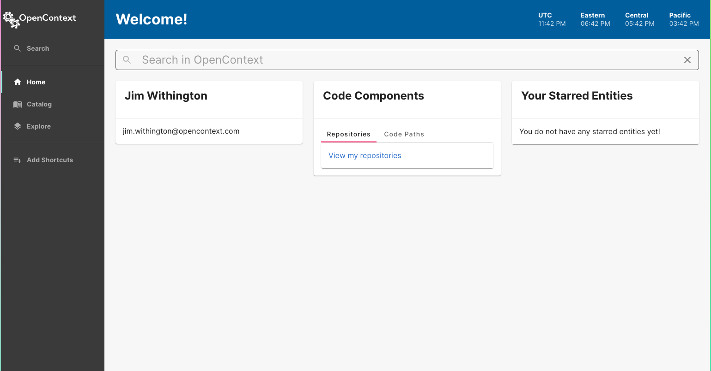

From there, click Catalog on the sidebar to see your catalog.

## Catalog

The catalog view provides a list of data elements around the default component.

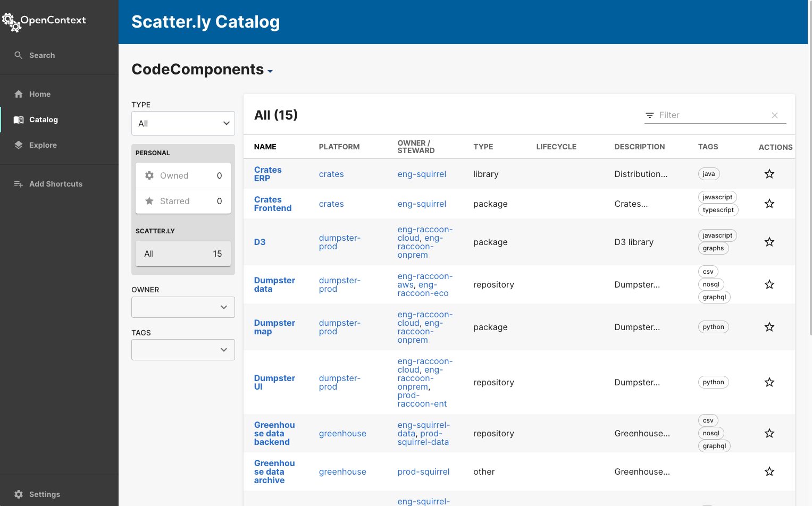

- `Name` The component name. This comes from GitHub, Kubernetes, or the YAML file you placed in your OpenContext repository. The `Name` link brings the user to the Context Page for the specified component.
- `Service` A service is a collection of code and platform components. It is viewed as abstraction level that provides insights into exposed features, without needing a deep dive into the details of all components. This also gives the owning team the possibility to decide about published artifacts and APIs.
- `Owner/Steward` Owner and Steward are defined in your [GitHub CODEOWNERS file](https://docs.github.com/en/repositories/managing-your-repositorys-settings-and-features/customizing-your-repository/about-code-owners).
- `Type` provides specific context about a component. For example, this component could be a `Repository`, `Package`, `Library`, `Document`.
- `Lifecycle` provides insight into the component’s environment. For example, this allows you to search for all Production components. Not all categories of components have lifecycles; see the Filters section below for one that does.
- `Description` is the long-form description imported from the component’s YAML. This could be a few words or a short paragraph.
- `Tags` are added and can track information about the component you’d like to search for or see at a glance. This can include things like as languages used, related tech debt, or other details.
- `Actions` allow a filter by ⭐ in order to high light a level of importance

Components are defined by your OpenContext Admin, and are accessed through the drop down menu on the top left of the page.

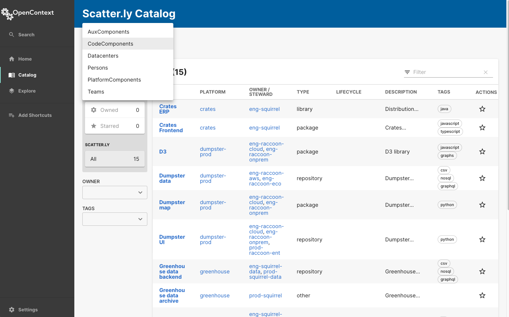

This view shows you all of your system components.

Components in OpenContext are broken down into the following categories:

- `AuxComponents` AuxComponents describe documents, tools, and other resources that may be associated with code and platform components.
- `CodeComponents` CodeComponents describe a software package, library, or other code entity.
- `DataCenters` These are where various components are located.
- `Persons` A person describes an individual such as an employee, a contractor, or similar. Person are mapped to [Kind: Team](../catalog/catalog-yaml-format/team) entities in the catalog and can be owned by a [Kind: User](../catalog/catalog-yaml-format/user) entity.
- `PlatformComponents` A platform component describes the infrastructure a service needs to operate, such as Bigtable databases, Pub/Sub topics, S3 buckets or CDNs. Modeling them together with code components and services allows you to visualize the footprint of platform components so you can create tooling around them.
- `Teams` A team describes an organizational entity, such as a team, a business unit, an interest group, or any other collection of people. Members of these teams are modeled in the catalog as [Kind: Person](../catalog/catalog-yaml-format/person).

### Filters

We also have some filters, aside from the main dropdown.

First,. we have `Type`. This tells you a bit more information about the component.

You can see in our sample that we have `Repository`, `Package`, `Library`, and `Other` as options. These options are associated with `CodeComponent`. PlatformComponents and other entities each have types related to their data set.

Our next filter, `Lifecycle` , tells us which environment the code path is in. This can be anything, such as Development, Test, Experimental, Production, UAT, etc. You'll notice that this filter won't show if it's not relevant, so here, we're looking at the list of AuxComponents.

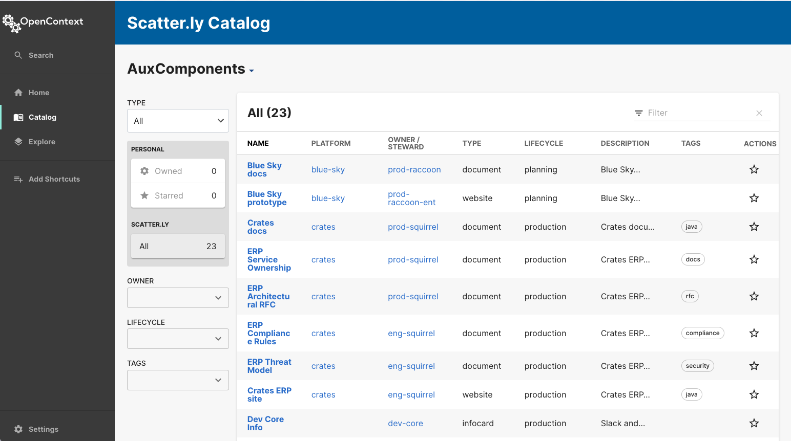

The `Owner` filter allows for single and multi selection of a team or subset of teams.

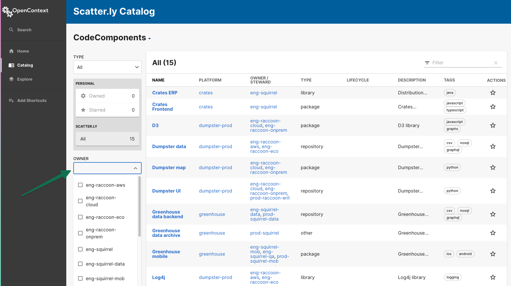

## Context Page

Clicking on any item from the Home/Catalog page takes us to the Context Page.

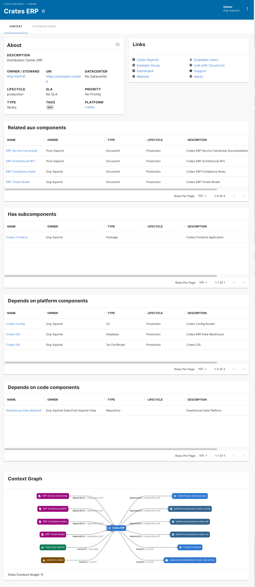

### About

The OpenContext `About` section provides some high level, at-a-glance details. For example, you can identify if the component is in `Production` , check the `Owner /Steward` , see who is `OnCall` , and check your `SLA` .

### Context Graph

The `Context Graph` allows you to click on any field to see a details page. It’s also another way you can navigate through your various contexts in order to see connections.

For example, you can click on `Crates FrontEnd` in this graph:

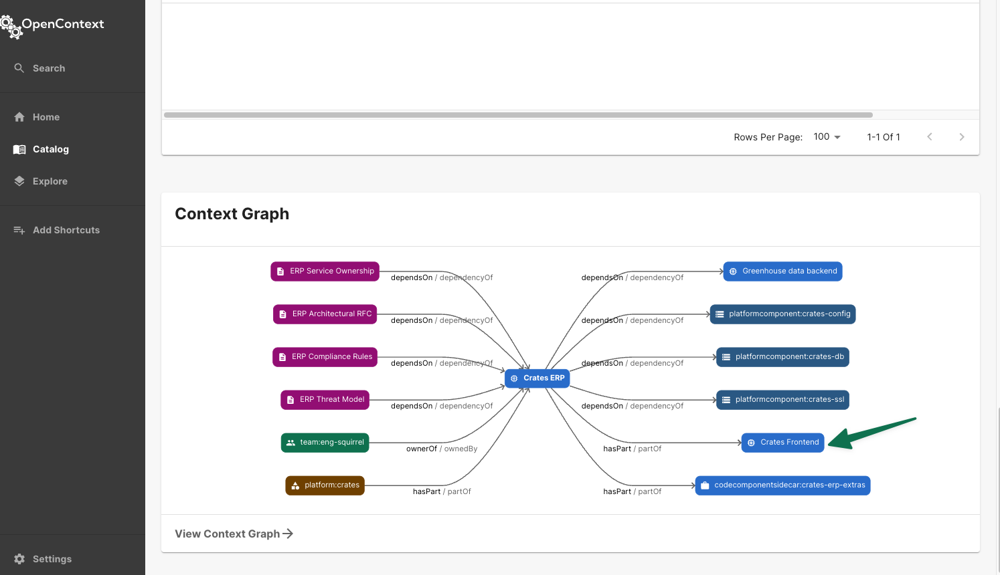

And then you’ll see the `Crates FrontEnd` Context Page.

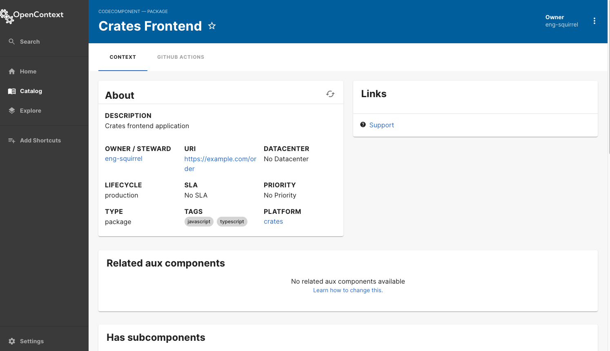

### Links

Links can be anything! This could include:

- PagerDuty link
- Slack channel for this project
- Runbooks
- Architecture documents
- Threat model

As you can see, the Links section can serve as the relevant context hub for each tool your team uses.

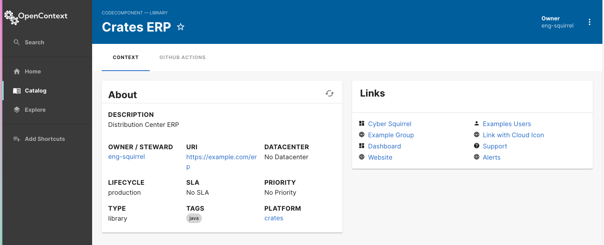

### Scenario

Using a Context Page, someone doing incident response can check their SLA, the teams involved, and more detailed links regarding the component in question. The `Links` card can be particularly helpful, as it could include runbooks, related internal or external documents, threat models, or vendor specific documents. This can help you whether you own and maintain the code or are using someone else’s code. OpenContext also shows you the primary, secondary and tertiary code connections via `Subcomponents` and `Dependencies`.

## Explore Page

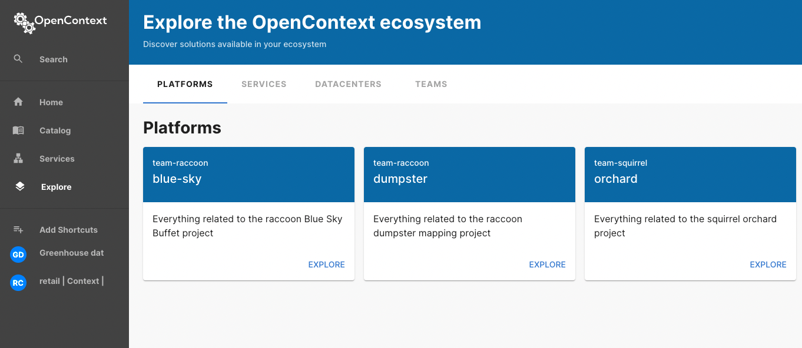

The Explore page has four tabbed sections of data. These provide a view into your technical stack and teams from different points in your schema.

- `Platforms` Platforms group collections of services and components that share terminology, domain models, business purposes, or documentation, i.e. groups that form a bounded context.
- `Services` A service is a collection of code and platform components. It is viewed as abstraction level that provides potential consumers insights into exposed features without needing a too detailed view into the details of all components. This also gives the owning team the possibility to decide about published artifacts and APIs.
- `Datacenters` These are where various components are located.
- `Teams` A team describes an organizational entity, such as a team, a business unit, an interest group, or any other collection of people. Members of these teams are modeled in the catalog as [Kind: Person](../catalog/catalog-yaml-format/person).

### Platform

This shows the top level of your schema, allowing you to drill in into your technical stack starting from the highest level.

For example, after clicking "explore" on the orchard platform, you are brought to the top level context page for the squirrel `orchard` project’s Platform Page. Here, you will find an About card, the Context Graph, and related Services. One approach to traverse the Platform is via the Relations.

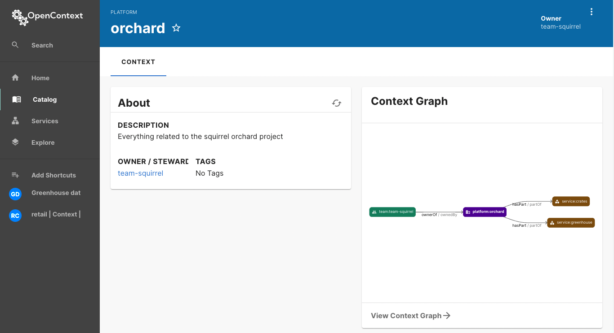

In the Context Graph, you can click on `service:crates` . That takes you to this service page, with `CratesERP` listed under “Has code components.”

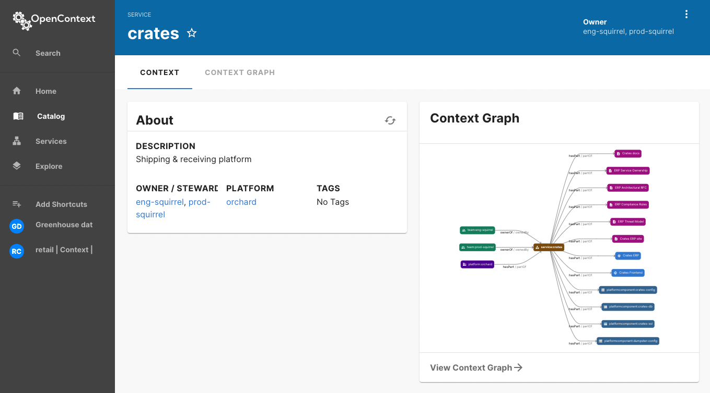

Another path you can take from a Platform page is through `Has services`.

Here, the Orchard Platform page has two services listed:

- `crates`
- `greenhouse`

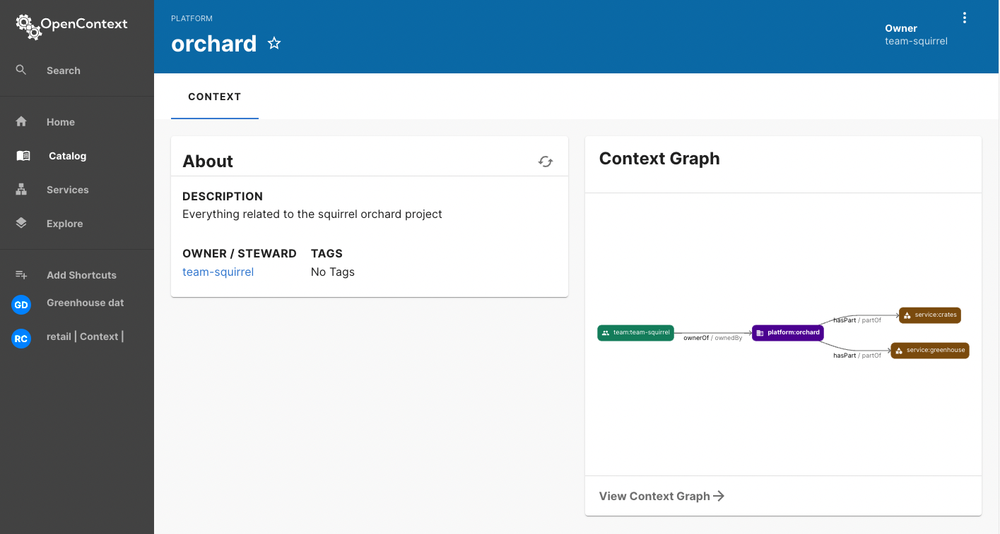

The `crates` link will take you here, just like it did when you clicked it from the Context Graph:

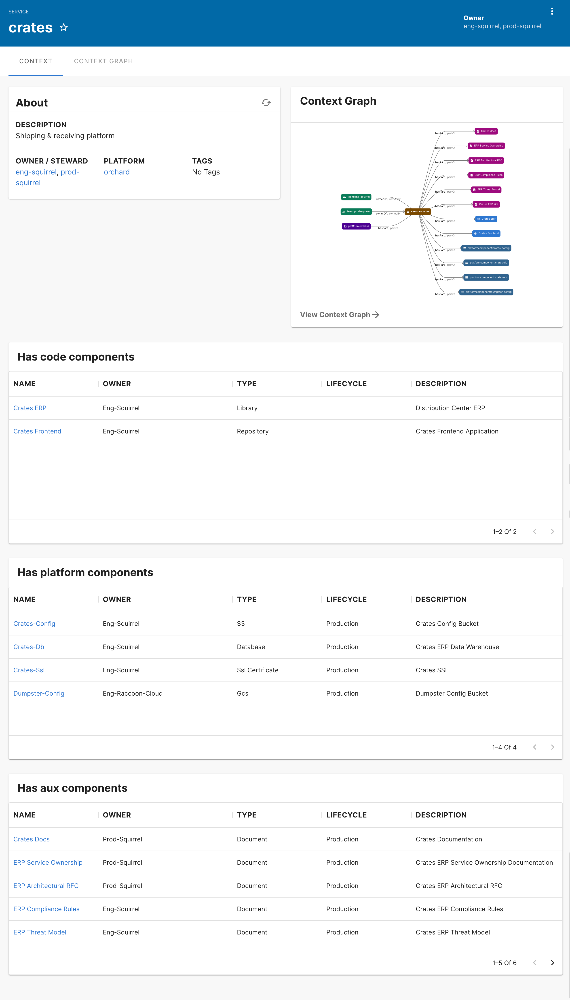

Your `crates` Context Page has the following data:

- About
- Relations
- Has code components
- Has platform components
- Has aux components

Under `Has code components` you can again see `CratesERP` !

As you can see, by starting at the highest level `Platform` , you can traverse through data elements _or_ graph elements to get to the same data sets.

### Services

Services are the second level of your schema. This tab allows you to view and dive into each service, giving your systems thinkers what they need to assess the state of your tech stack.

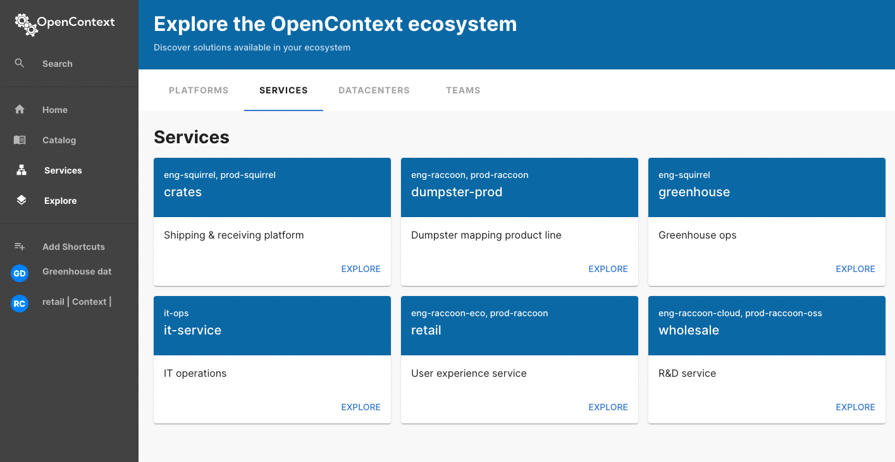

Let’s continue navigating the Crates schema from different slices within the system.

From the Services tab, we select explore under `crates`, which brings us to the _Service_ page for `crates`.

Since the Service page displays related components as well as their lifecycle (such as production, experimental, etc.), these views provide a lot of insight, especially for new hires or transfers. Clicking into `CratesERP` gives your new hire quick, critical context about `CratesERP`.

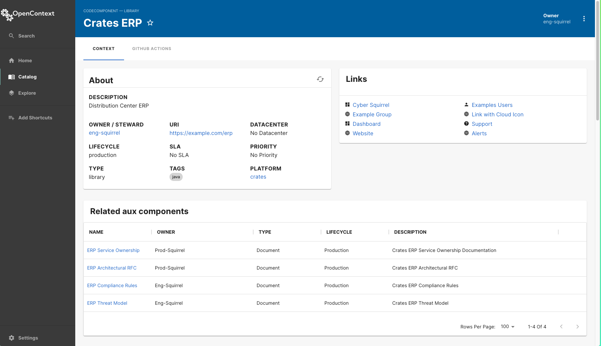

As before, we can navigate via the Relations, Has code components, Has platform components, or Has aux components, depending on what level or slice of information you seek.

### Datacenters

This view lets you investigate your technical stack from the perspective of your datacenters. Which areas of your technical stack are powered by AWS? GCP? This tab will show you!

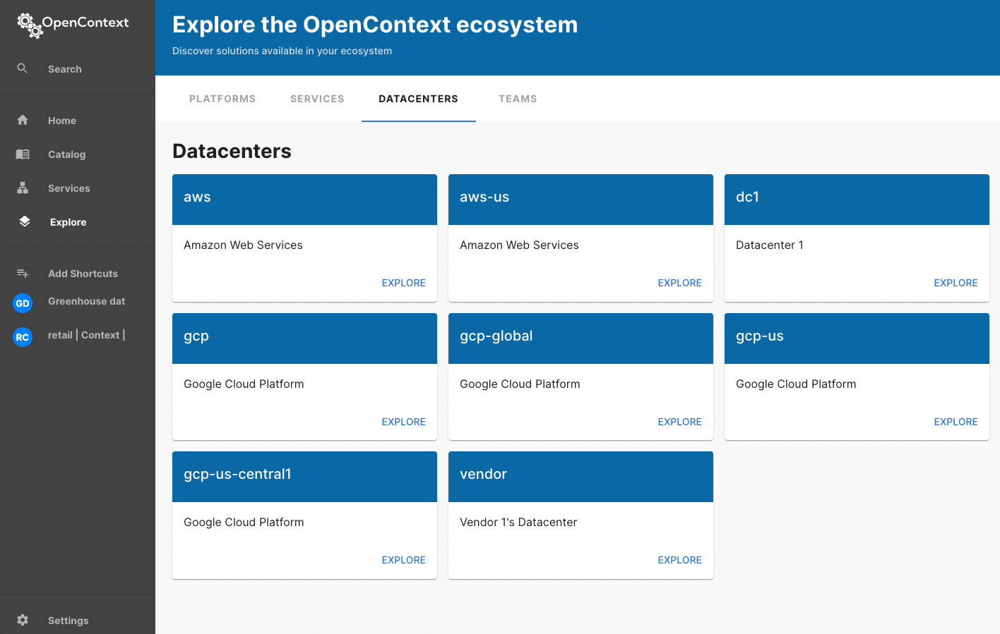

Here, the `Context Page` for Amazon Web Services shows you the usual About, Links and Context Graph.

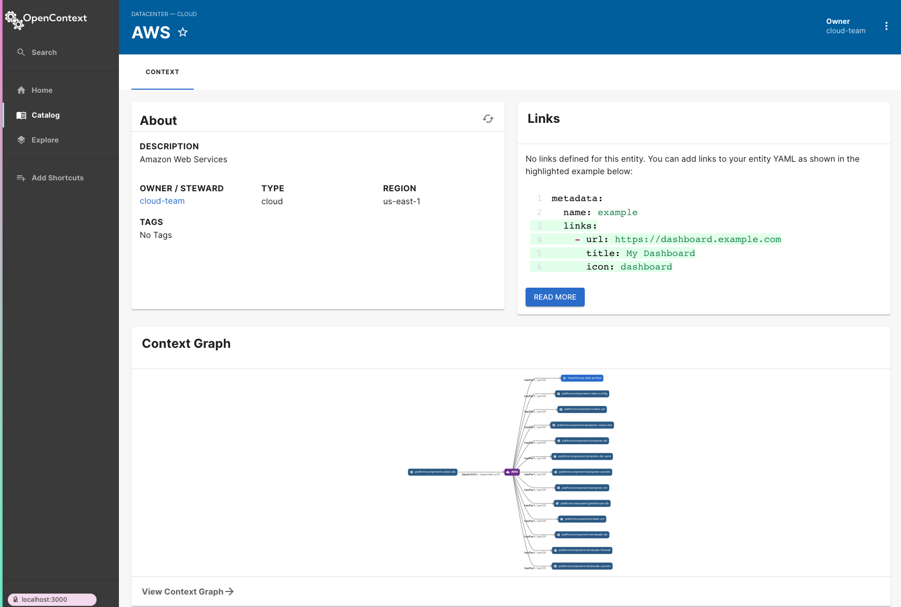

By clicking “View Context Graph,” you can view the AWS Catalog Graph to gain a different level of insight in a single view.

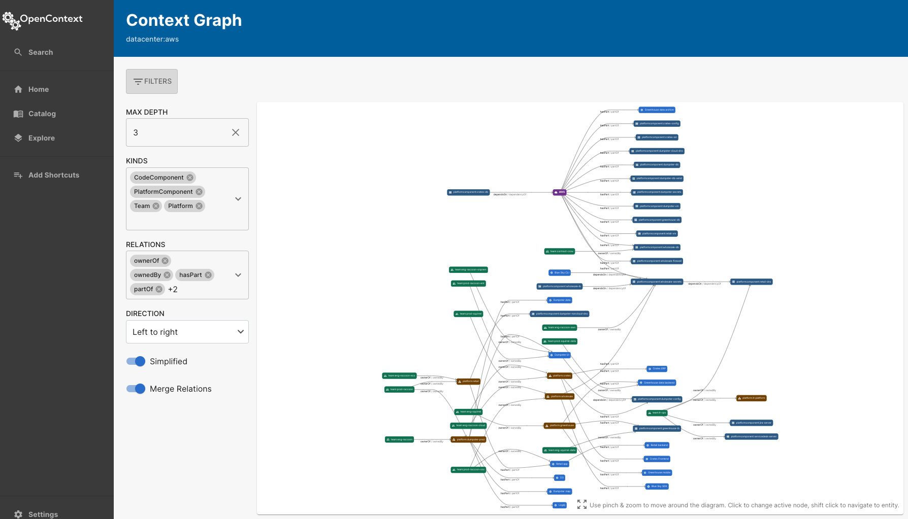

### Teams

The Teams tab gives you a view of the team hierarchy based on _contributions to code_. This is not an HR organization chart. Instead, it’s a view into how work actually gets done within your organization.

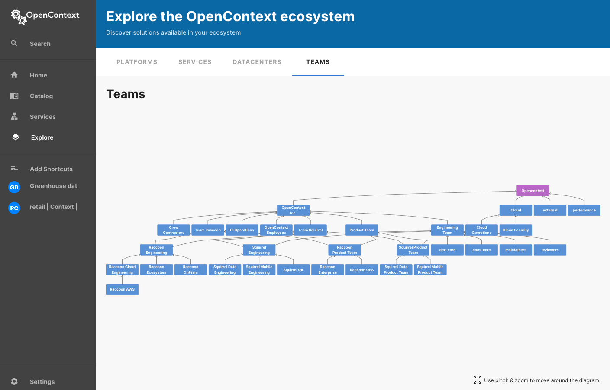

## Example: Team Context Page

If you were just paged at 2am, with no prior knowledge of `CratesERP` , who do you turn to? A Team's Context Page will help!

Let’s look at the `CratesERP` About card to learn how to identify who is doing the work.

You’ll notice one option listed under `Owner/Steward` : `eng-squirrel`.

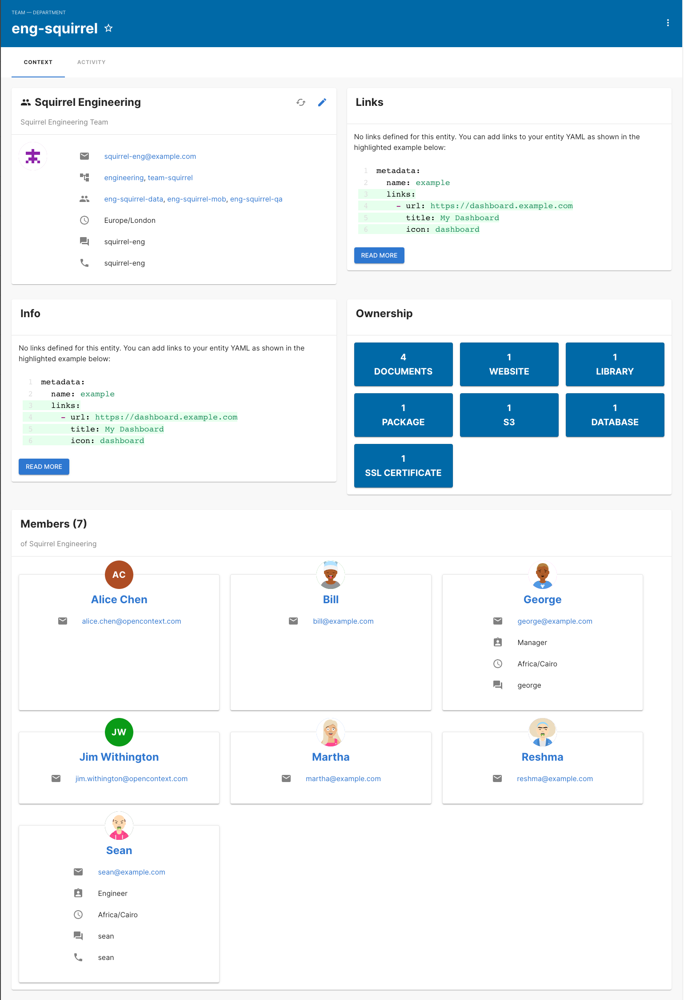

Here we see contact info for the Squirrel Engineering team, links and info, an ownership section, and members of the team. This page allows you to understand:

- What does the team own?
- Who are the subject matter experts (SMEs), based on their code contributions?
- How can you contact the SMEs?

You can then continue to traverse through the technical stack from here. Clicking on `Library` in the Ownership section sends you to this view.

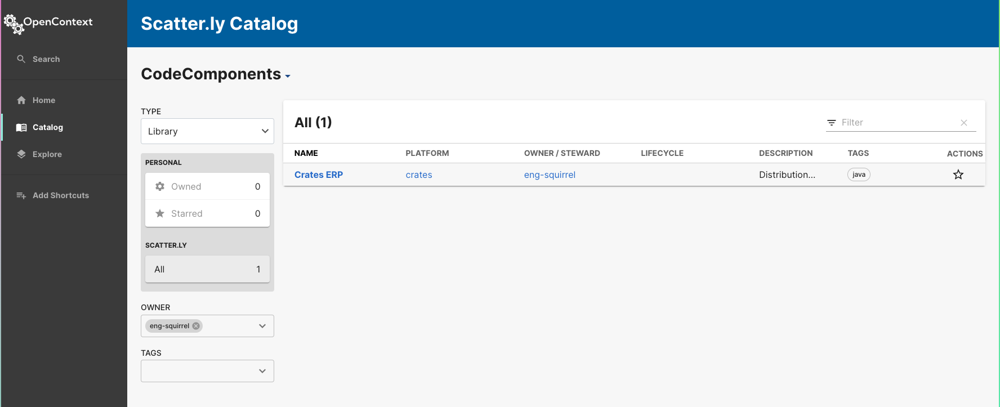

From here we understand that one of the Code Components eng-squirrel owns is, indeed, `crates ERP`!
