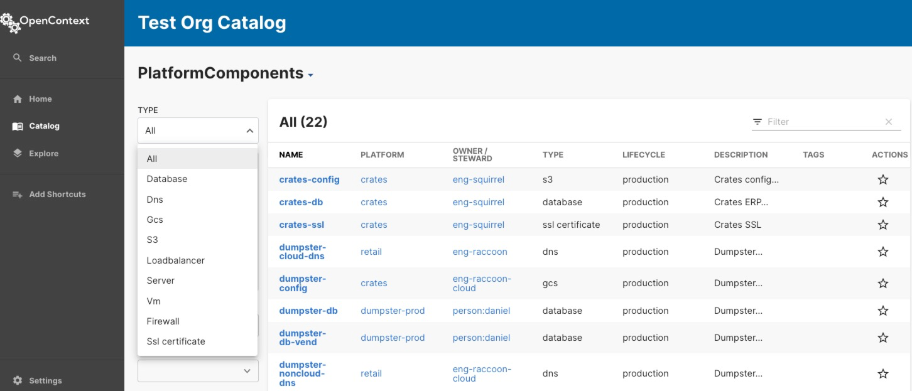
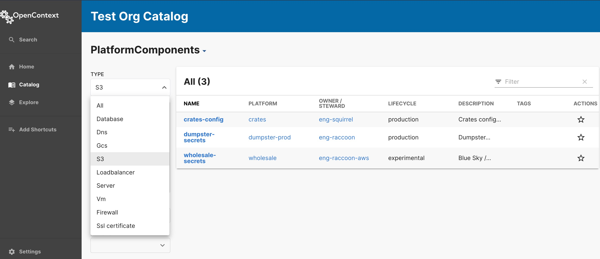
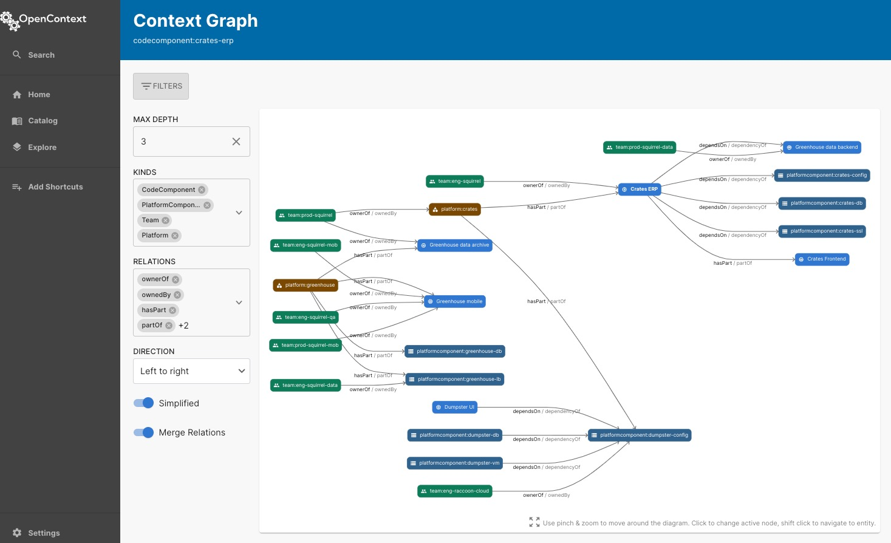
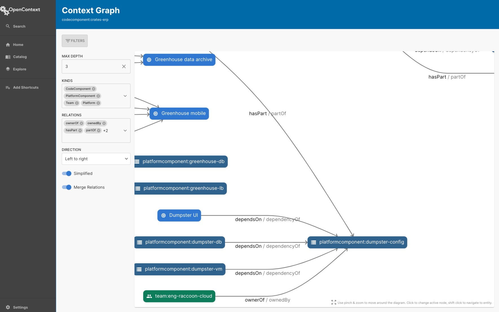
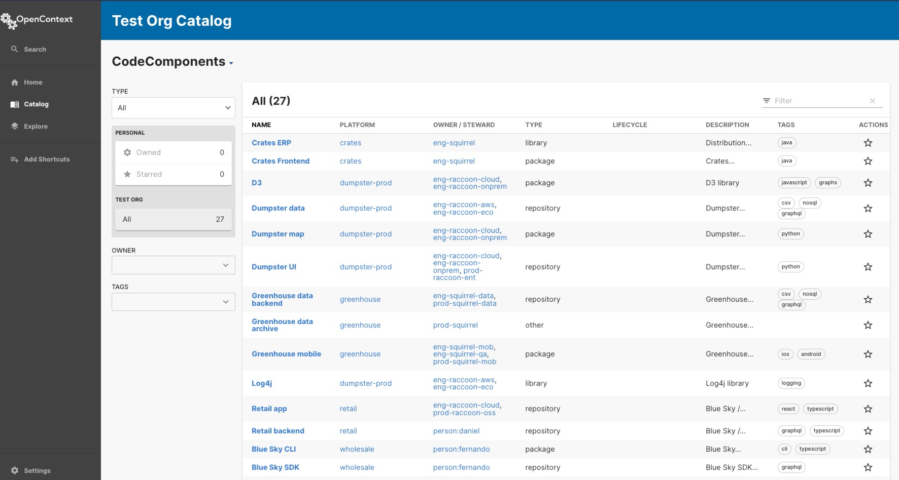
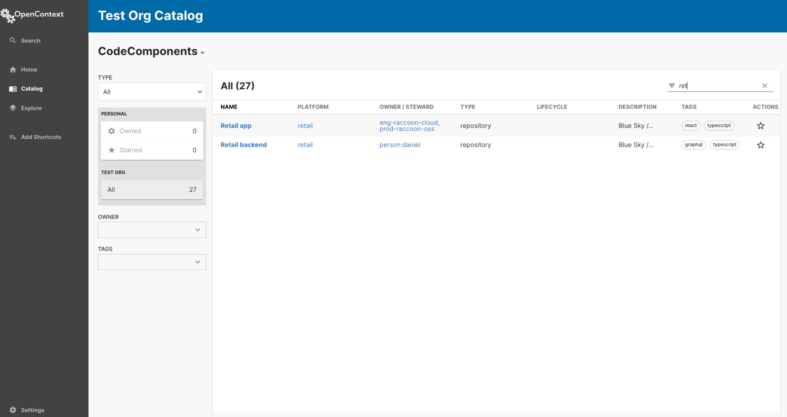
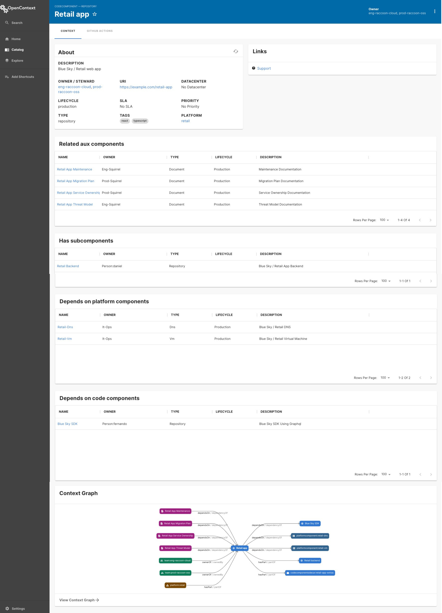
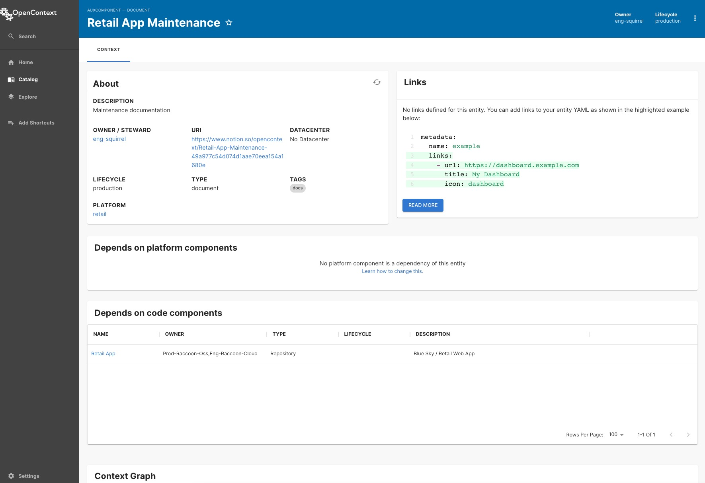
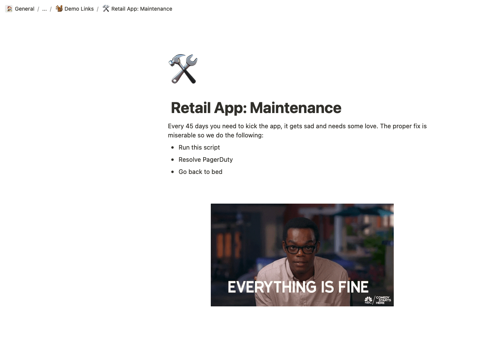

# How to Solve Problems

Here are some sample use cases that show how OpenContext can solve problems within your organization.

## S3 Buckets

If you are interested in identifying all your `S3` buckets across your Schema, you would select PlatformComponents from the Home/Catalog page.

Then, you could filter by the type `S3`:

## Incident

Another **UseCase**: Let’s say Team Squirrel is experiencing an incident, but can’t identify any change to the squirrel code base. In researching via OpenContext, they select the Relations graph view:

Team Squirrel then notices a cluster toward the bottom of the graph; zooming in, they see that Dumpster Config connects to Crates. This previously-hidden Infrastructure connection allows them to investigate if there was a change to Dumpster Config that might have impacted the Squirrel team. Voilà!

---

## On Call

The Scatter.ly on call SRE, Jamie, is paged that `Retail App` is down. It’s 2am on a Saturday and Jamie is not as familiar with this code path as they would like. Jamie starts with the OpenContext Catalog Page

Being it’s 2am, Jamie finds it easier to start typing in Retail in the Filter

Seeing Retail App, Jamie clicks on it to see the Context Page

As Jamie scans to the Context Graph, they see the `Retail App Maintenance` Clicking on this, Jamie sees the link to the Notion Document

Clicking on the Notion Document Jamie is able to find the information needed to resolve the incident.

