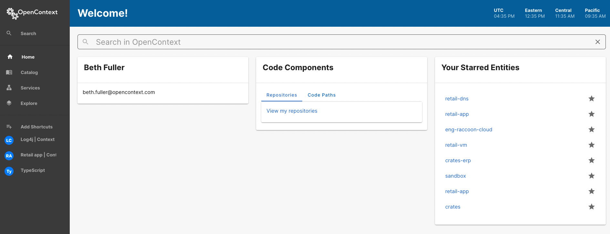
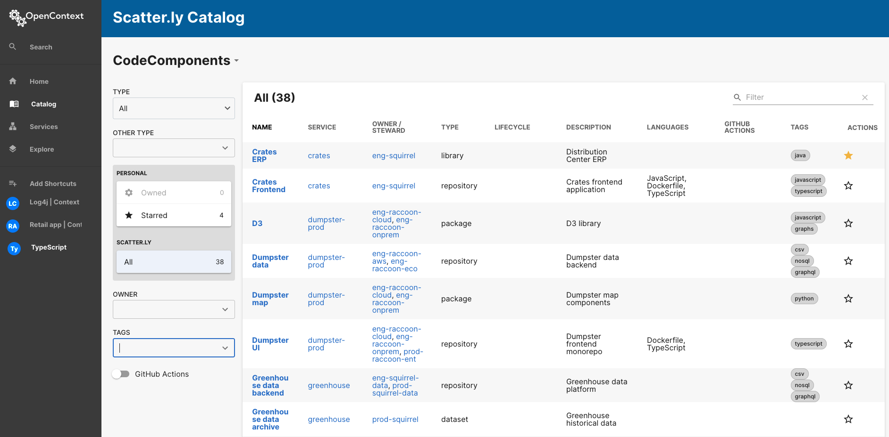
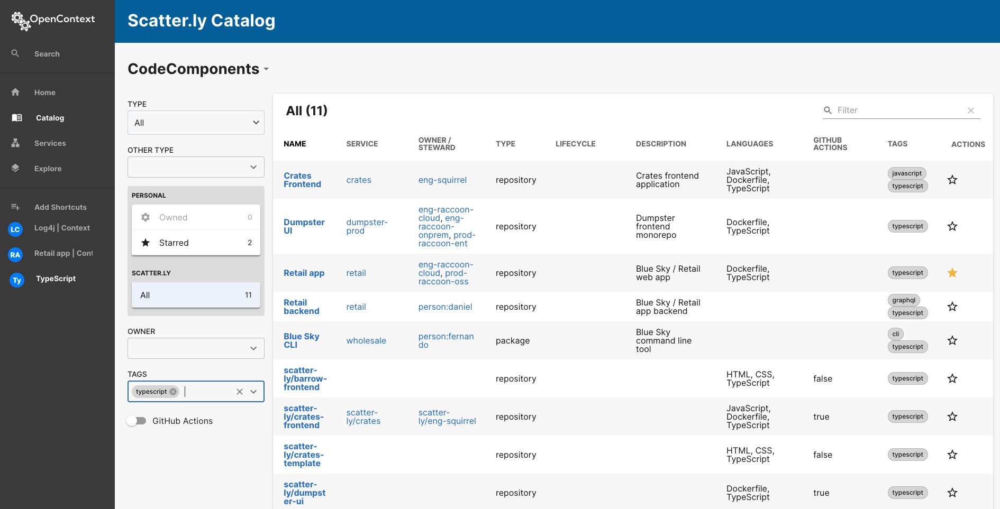
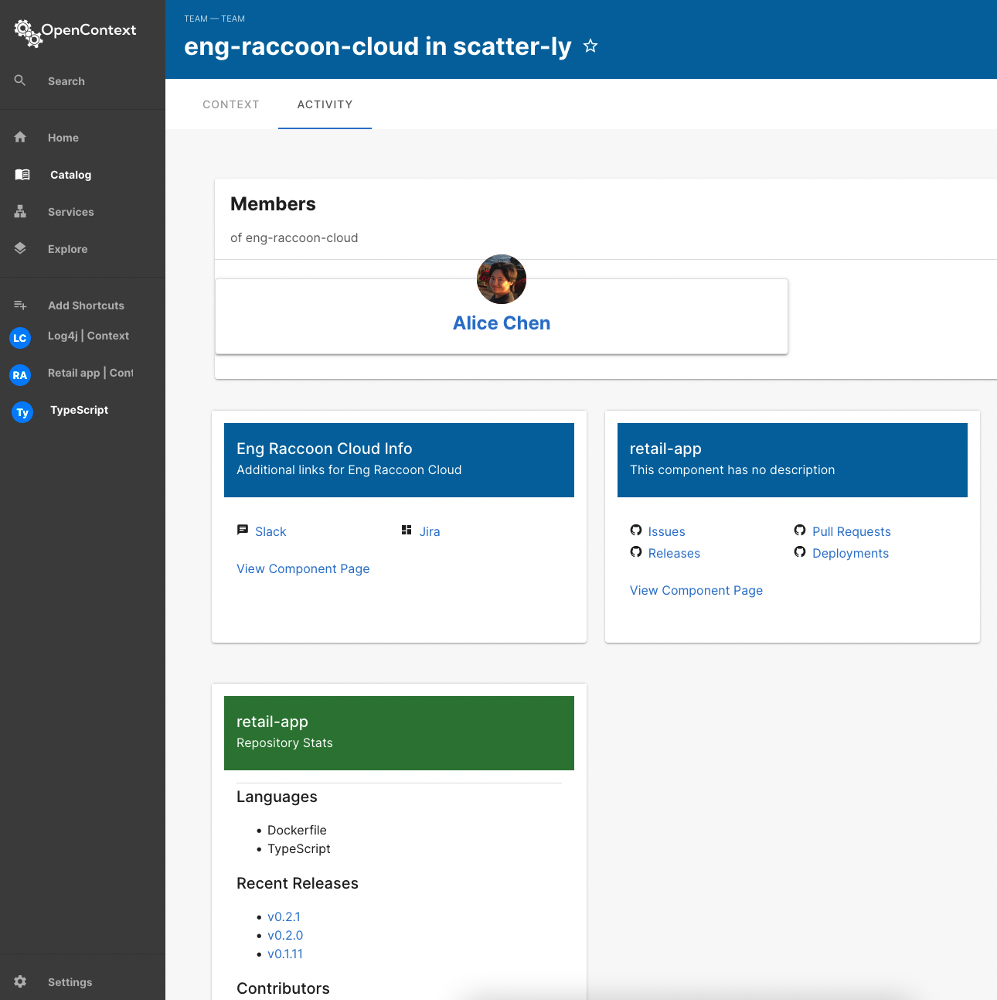

# User Journey 1: Code and Ownership

You’re ready to try out the OpenContext demo! Let’s walk through the world of [Scatter.ly][scatterly], our fictitious tech company, to see how that works.

## The Problem

In the user journey, we’ll have you walk in the shoes of both the Squirrel team and the Raccoon team. Specifically, the teams need to identify where they have Typescript in their codebase. This journey is going to take you through how to answer:

- Do we have Typescript in the code base?

- Which code paths have Typescript?

- Which team is listed as owner?

Let’s get started!

## The Scene

[Scatter.ly][scatterly], a five-year-old, entirely fake company, looks like this:

- They have two teams: Team Squirrel and Team Raccoon

- Team Raccoon is the long-timers with a healthy amount of tech debt. They have a tendency to just throw things in a bucket and hope for the best.

- The Squirrel Team is determined to do things the right way from the beginning and use all the best practices. They have a fondness for spreadsheets.

In our user journey, we'll walk in the shoes of both teams to take a look at [Scatter.ly][scatterly]'s original product. By doing this, we can see how deeply integrated their code is to the entire [Scatter.ly][scatterly] technical stack. This will help us walk through a few problems in order to see how you can use OpenContext to solve some of these same problems at your own company.

---

One other important point: you’ll take this journey using just our Demo data. I’ll walk you through that path as the primary steps to take in our User Journey.

To kick off our journey, we want to reduce the number of fires our fictional teams are experiencing. The first step is to get a sense of what exists in [Scatter.ly][scatterly].

For the purposes of this guide, we want to verify where we use Typescript in the tech stack.

## Sign-up and Sign-in

<!-- vale off -->
<!-- allows the word peasy -->

I’ll assume we’ve provisioned an OpenContext demo instance for you. If not, you can sign up [here][signup]. You only need to have a Gmail address and enter a company name! Easy peasy.

<!-- vale on-->

- I’ll assume you got an instance already, and have the URL. If so, go to **Review the Data.**

- If you haven’t gotten provisioned, follow our [sign-up process here][signup].

## Review the Data

Let’s talk a little more about [Scatter.ly][scatterly]. In our fictitious company, just like your real company, it’s hard to know everything once teams get to be a certain size.

Likewise, when code gets to be a certain age, it’s hard to find all the templates, versions, and languages being used. Maybe a piece of the technical stack just works, and you don’t want to mess with what’s working. Unfortunately, those things can cause your next fire, and that’s a big bummer.

In the world of [Scatter.ly][scatterly], we don’t have to remember where we placed the acorns, because OpenContext shows you all the spaces — secret **and** known!

We’re ready to start looking for any hidden gems in your technical stack.

So let’s look for those hidden gems. If you’ve clicked on the application url you should see the Home Page.

Let’s walk through with the help of our trusty Raccoon Detective.

### Sorting and Filtering

On the sidebar, you will see `Catalog`. Click this to view the [Scatter.ly][scatterly] repos and code paths.

Next, take a look at the top right-hand `Type` filter. You should see `Repository` and `Code Path` listed. In your demo instance you will see more Repositories as we have many services in Scatter.ly. When filtering to Code Path you’ll see a small collection.

NOTE: If you have a Monolith, have no fear -- your data still works in OpenContext.

### Finding TypeScript

Remember the goal: finding TypeScript. We’ll now ask questions like:

- Do we have Typescript in the code base?

- Which code paths have Typescript?

- Which team is listed as owner?

Let’s start on the Catalog page. If you browse the second to last column you’ll see the TAGS column. These tags are auto-discovered from GitHub. If TypeScript is present, you will see it as a an option to select in the TAGS Filter.

On the left-hand side you’ll see a filter called `TAGS.` Click on the arrow to expand the TAG options, scroll toward the bottom, and find TypeScript.

When you click on TypeScript, the display grid will filter down to only CodeComponents with a TypeScript tag. You can see that [Scatter.ly][scatterly] has a few things that use TypeScript.

### Who Owns the TypeScript Code Paths?!?!

Our next goal is to understand **who is working** on TypeScript. By doing this, we’ll know who needs to be involved in the version bump, while also understanding where it lives within the Scatter.ly technical stack.

After filtering using the TypeScript tag, you should see a screen that looks similar to this:

We can now identify which code paths have a CODEOWNER, and which do not.

Let’s get a little curious and look at the `scatter-ly/retail-app`

Click on the link to go to the team page of the `eng-raccoon-cloud` team.

The Team Activity page shows you:

- The relevant member of the team (in this case Alice Chen),

- the code paths they own

- repositories they own, and

- the languages and releases associated with repository.

Additionally, OpenContext includes clear hyperlinks to the related Context pages and/or GitHub Repository.

## Make that meeting a Slack update

As you can see, now you have a much better idea of who owns what, how code paths are connected, and when one team is going to impact another.

So in the time it takes to listen to Sleater-Kinney’s _Hot Rock_ album, you are able to identify hidden gems such as if we have Typescript in the technical stack, how pervasive it is, and who are the subject matter experts. This allows you to target the right folks, reduce context switching for your teams, and hopefully make that meeting a Slack update instead!

[scatterly]: https://scatter.ly/
[signup]: https://portal.app.opencontext.com/landing?_gl=1*1j93fd4*_ga*NjI2OTcyNDg5LjE2NDE0MDgyMDQ.*_ga_SVT89JQZS8*MTY5NDcwNDE4Ni42OC4xLjE2OTQ3MDQxOTIuNTQuMC4w
