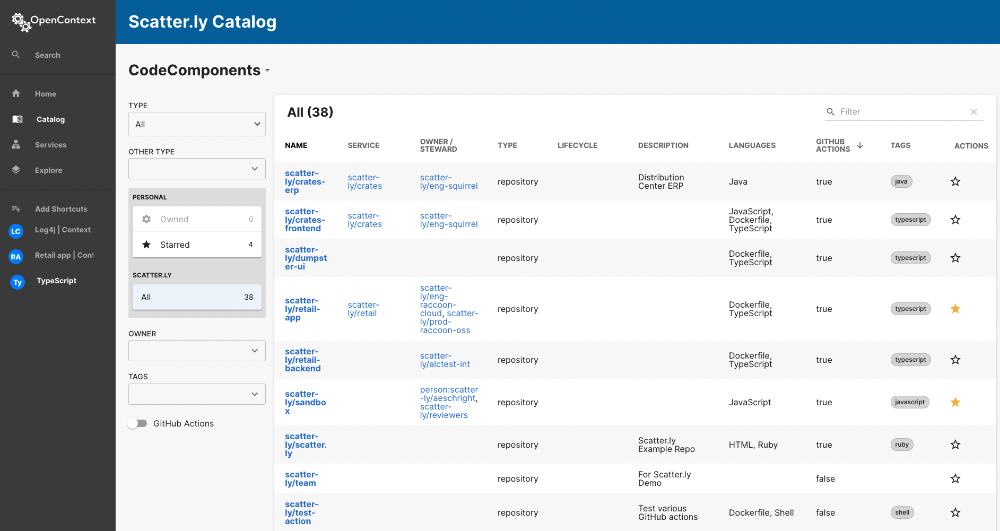
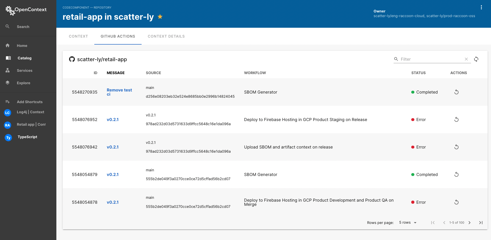
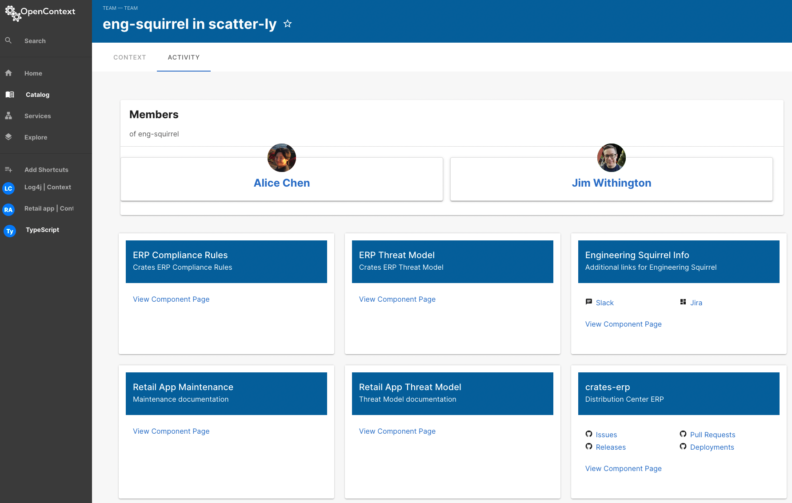
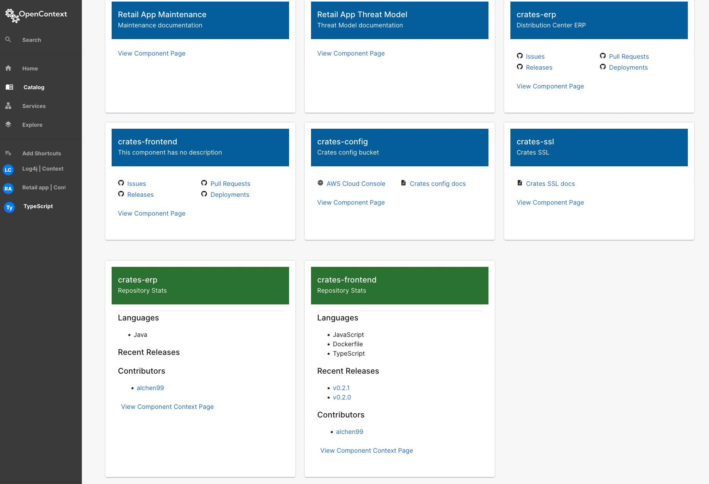
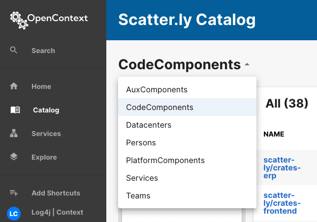

# User Journey 2: Best Practices

## The Problem

<!-- vale off -->
<!-- allow capitalization of DevOps -->

Welcome to the second OpenContext User Journey. The AppSec and DevOps Team at [Scatter.ly][scatterly] just kicked off a project to implement guardrails for our teams. Part of this project is a set of [Scatter.ly][scatterly] specific best practices — but not everyone is bought in.

<!-- vale on -->

So, for this journey, we are going to check on the team’s progress.

Their targeted best practices include the use of:

- GitHub Actions

- CODEOWNERS

- Threat Models associated with their CodeComponents

- Runbooks associated with their CodeComponents

With the help of our raccoon detective, let’s walk through how to identify which best practices are in place at [Scatter.ly][scatterly]!

## Finding out if your best practices are being followed

We are looking for the following information:

- GitHub Actions

- CODEOWNERS

- Threat Models
  <!-- vale off -->
  <!-- allows capitalization -->
- Runbooks
<!-- vale on -->

We can use a few sorts and filters to track this down. In fact, we have a few different ways to look at the data.

So let’s get started by looking at the OpenContext Catalog page!

### GitHub Actions

If you are setting up guardrails around your releases via GitHub Actions, you may want to track if teams are using those guardrails, as well as what the data looks like. Let’s start by seeing who is actually set up with GitHub actions.

To do this, we’ll start with the Catalog page in the OpenContext Application. When you click on Catalog, you’re sent to the default page: CodeComponents.

Perfect! Now you’ll see a header called `GitHub Actions`. You can click on this to sort. This shows you every CodeComponent that either has or doesn’t have GitHub Actions. Brilliant!

You can also check via the filter on the left hand side. You’ll see a GitHub Actions toggle; slide it to on and voilà! You only see the CodeComponents with GitHub Actions set up.

The last thing we are going to do here is check on a code component that has GitHub Actions, in order to familiarize ourselves with where to find the data. For this, let’s select the `Retail App` — specifically, `scatter-ly/retail-app` .

After clicking on the Code Component, you’ll be taken to the detail page. If you look across the page you’ll see a GitHub Actions tab.

Clicking on that you’ll be able to see the most recent GitHub Actions for the Retail App.

### CODEOWNERS

Many teams are implementing CODEOWNERS as a way to understand who is assigned as owner of a repository. Often having an owner helps you quickly identify who to talk to first when your AppSec team finds a vulnerability or when there is an incident.

So: let's see how to use OpenContext to identify the contributors in your codebase!

To see who has a CODEOWNER, start at the Catalog page default view of CodeComponents.

Looking at the headers you’ll see `Owner/Steward`. Clicking on this will sort between not having a CODEOWNER, and having a CODEOWNER.

Now for a little more information, let’s sort look at a specific team — `scatter-ly/eng-squirrel`. To get here, you can start typing “squirrel” in the Filter search box on the top right.

Alternatively, if you’ve filtered to everyone who has an Owner, they are likely already at the top of this list for you. Find it? Ok, now click the `scatter-ly/eng-squirrel`link to get to their team page.

The team page will provide you some important details about the team, but the real magic happens on the Activity tab.

The bottom of the Activity tab shows you which Repositories the team owns!

A lot of this tab is dedicated to the various components the team owns, and you can click through to any of the component context pages.

Then, at the bottom of the page, you’ll also see the **repositories** this team owns, with some key details. The magic? You’ll have a list of contributors!

Often we have folks that are contributing, across teams, to the repositories or code paths or services we own. OpenContext provides you this simple way for you to track who else is part of your cohort of experts. ✨

### Threat Models and Runbooks

I’m going to combine these since the path to find them is the same. Let’s see if Scatter.ly has any Threat Models or Runbooks.

To do this, we once again start at the Catalog view. You’ll see an arrow to expand the filter options by CodeComponent. Click on that to see the drop down list.

Here, click on AuxComponents. These are all the documents built by magic YAML imports (we’ve already loaded examples for the demo). You can add links to all sorts of things here. In fact, we require a static URL that links to a Code or Platform component.

In looking at the list, you’ll see a few examples of Runbooks or Threat Models. Personally, I’m a fan of the `Retail App Threat Model` for a Threat Model. So feel free to find that and click on it.

From here, do the following:

- Find the URI in the About card

- Below the About card you’ll see depends on Code Components with Retail App as the option

- Click on the link

Now you’re on the Retail App context page. If you look at the AuxComponent section just below the About Card, you’ll see ALL the links that have been associated with the Retail App — including, of course, `Retail App Threat Model`.

## It’s not discovery. It’s assurance.

We now have a context map for our future selves. With this new context, you’ll be ready to take on challenges, reduce fire drills, and sleep better at night.

All of this will help people be more responsive to the complex system that they grow and maintain. (Thanks to Kelly Shortridge for the image below!)

[scatterly]: https://scatter.ly/
